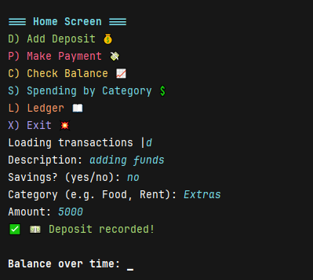
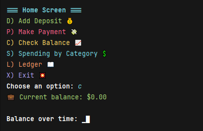
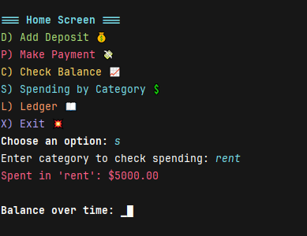
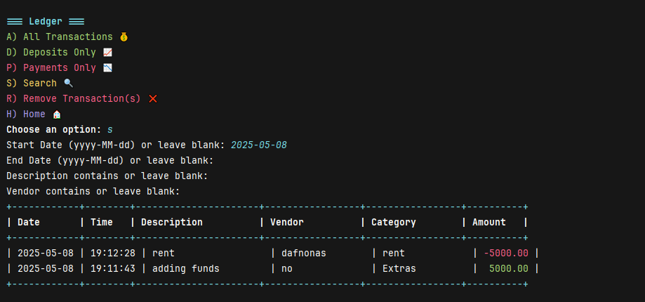

# Accounting Ledger App

A simple command-line Java application to manage financial transactions via a CSV-backed ledger.

## Features ##
Custom ASCII Art Banner: Displays “LG10” (or “LG TEN”) at startup.
Load Transactions Reads and writes transactions to `transactions.csv`.
Interactive Menu Add, view, search, and delete transactions.
Data Persistence All ledger entries are stored in a CSV file.

----------------------------------------------------------------------------------------

## Prerequisites ##
Java JDK 8 or newer installed.
A terminal or command prompt.

----------------------------------------------------------------------------------------

## Installation ## 
- Clone the repository
   
```git clone git@github.com:KINGZANIFICENT/LearnToCode_Capstones.git```
- then
```cd AccountingLedgerApp```

----------------------------------------------------------------------------------------

- Compile The Source Files
```mkdir bin```
- then
```javac -d bin src/com/pluralsight/*.java```

----------------------------------------------------------------------------------------

- run
```java -cp bin com.pluralsight.AccountingLedgerApp```

----------------------------------------------------------------------------------------

## installation Without Maven ##
- Clone the repository

```git clone git@github.com:KINGZANIFICENT/LearnToCode_Capstones.git```
- then
```cd AccountingLedgerApp```

----------------------------------------------------------------------------------------
- Compile 
``mvn clean package``

- run
``mvn exec:java``

----------------------------------------------------------------------------------------

## Usage ##
Ensure transactions.csv is in the working directory (it will be created if missing). On startup, you’ll see the ASCII
art banner.

Navigating the Main Menu
Immediately after the banner, you’ll be prompted with a letter-based menu just type the letter of the action you want:

D Add a Deposit
– You’ll be asked for description, vendor, category, and amount.
– The entry is saved to transactions.csv.

P Make a Payment (Debit)
– Similar prompts, amount is stored negative.

C Check Current Balance
– Shows your up-to-date balance without listing transactions.

L Ledger
– Sub-menu to view all, deposits, payments, search, or remove transactions.

X Exit
– Closes the app

## what the app does ##

Persistent Storage
File Location & Name
Stored by default as transactions.csv The filename is defined in AccountingLedgerApp.java as

```private static final String FILE_NAME = "transactions.csv"```

## loadTransactions() ##
- Checks new File(FILE_NAME).exists().
- If false, it simply returns (no crash) and the app will create the file when you add your first entry.

- It Uses a BufferedReader/FileReader to read each line.
- For each line, calls Transaction.fromCsv(line), which parses the comma-separated fields into a Transaction object:
- Splits on ,

- It Parses the ID (an int), the date (as a String), the description (String), and the amount (as a double)
- Adds each Transaction to the front of the in-memory List<Transaction> transactions so that when you “view all” 
- it’s already reverse-chronological.

## Saving New Entries ##
- The addTransaction()
- Prompts the user for date, description, and amount.
- Creates a new Transaction with an auto-incremented ID (based on the last-used ID + 1).
- Calls saveTransaction(t), which uses a FileWriter in append mode (new FileWriter(FILE_NAME, true)) to add a single line:
- ID,YYYY-MM-DD,My description,123.45
- Confirms success back to the user.

## Overwriting on Delete ##
- When you delete an entry, the app:
- Removes the matching Transaction object from the transactions list.
- Opens transactions.csv in overwrite mode (new FileWriter(FILE_NAME, false)),
- Iterates the updated list in reverse order and writes each back out, rebuilding the file without the deleted line.

## Interactive Menu ##

while (true) {
printMenu();
String choice = scanner.nextLine().trim();
switch (choice) {
case "1": addTransaction();   break;
case "2": viewAll();          break;
case "3": searchTransactions(); break;
case "4": deleteTransaction(); break;
case "5": return;             // exit cleanly
default: System.out.println("Invalid choice.");
}
}

- Uses Scanner.nextLine() for line-based input (avoids mixing nextInt() and leftover newline issues).
- Each menu option is factored into its own method for clarity and testability.

## Add a Transaction ##
- Prompt: date → description → amount.

## Validation: ##
- Amount parsed with Double.parseDouble(), so non-numeric input throws a catchable NumberFormatException.

## View All ##
- Simply iterates the transactions list (already ordered newest first), and prints:

## ledger example ##
ID | Date       | Description           | Amount
―― | ―――――――――― | ――――――――――――――――――― | ―――――
3 | 2025-04-28 | Coffee at Starbucks   | –4.25
2 | 2025-04-26 | Rent                  | –1200.00
Uses System.out.printf() for column alignment.

## Search ## 
- Prompts: “Enter keyword:”

## Filters with ##
- if (t.getDescription().toLowerCase().contains(keyword.toLowerCase())) { … }
- Displays only the matching subset, preserving the reverse-chronological order.

## Delete ##
- Prompts: “Enter ID to delete:”
- Parses the integer, finds the first Transaction with that ID, removes it from transactions, then calls the overwrite step described above.

## Error Handling ##
- Missing File

- loadTransactions() checks existence first; if no file, it doesn’t try to read. 
- The very first call to saveTransaction() will create the file automatically.

## Corrupt Lines ##
- Wrapping each read in a try { … } catch (Exception e) { System.out.println("Skipping bad line: " + line); } 
- means one malformed CSV line won’t kill the whole app.

## Invalid User Input ##

- Adding a transaction
- Non-numeric amount → caught by NumberFormatException, prints “Invalid amount” and returns you to the menu.
- Bad date string → you could wrap LocalDate.parse(), but currently it just stores whatever you type; 
- adding a parse-check is a good extension.

## Clean Exit ##
Choosing “5” simply returns from showHomeMenu(), allowing main() to finish without leaving open file handles or dangling threads.

## Images 
----------------------------------------------------------------------
## Homescreen

----------------------------------------------------------------------
## Depositing

----------------------------------------------------------------------
## Making A Payment

----------------------------------------------------------------------
## Checking Balance

----------------------------------------------------------------------
## Accessing Ledger Sub Menu

----------------------------------------------------------------------
## Looking At All Transactions

----------------------------------------------------------------------
## Looking At All Deposits Then Payments

----------------------------------------------------------------------
## Searching By Date

----------------------------------------------------------------------
## Removing A Transaction

----------------------------------------------------------------------
## Exit Screen


